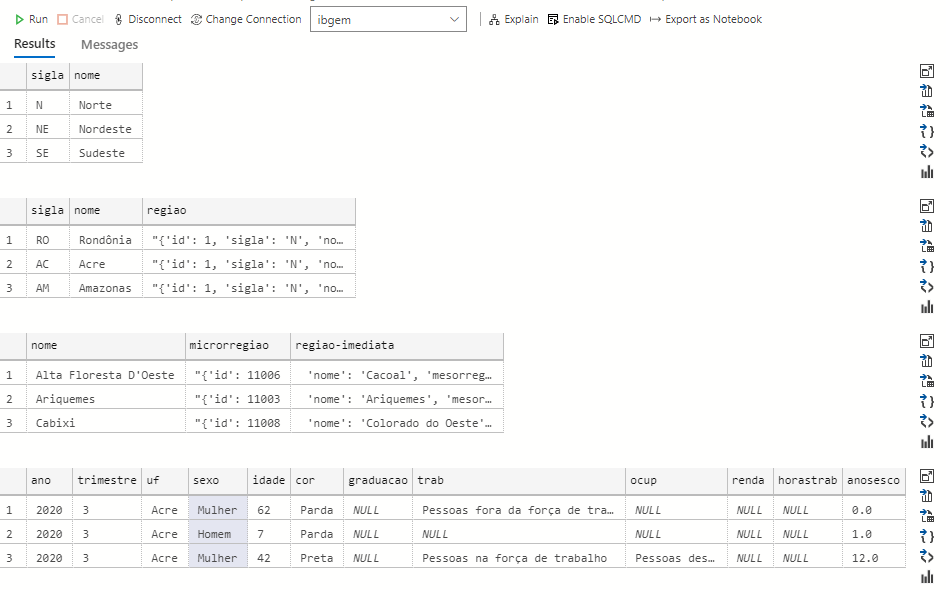

#  Exercise the following concepts:
# ✓ SQL databases.
# ✓ S3 connection to SQL Server.
# ✓ Import data from csv files to SQL Server tables.

In second part we need create the database SQL Server (free tier) in AWS.
After that, The  SQL Server RDS Instance need see and read the files in S3.
For this, follow this steps:
* 1 - IAM Policy for access to S3 with this actions select: ListAllMyBuckets, ListBucket, GetBucketACL, GetBucketLocation, GetObject;
* 2 - In Resources, add ARN for bucket (and object) and enter our S3 bucket name (igti-bootcamp-ed-2021-evangelista);
* 3 - Create Role  to use the Policy we just created and attach permissions policies used before;
* 4 - Associating your IAM role with your DB instance:
  *  _In this case, is necessary use a user that granted that permissions: AmazonRDSFullAccess and AmazonS3FullAccess_
  *  With this user logged, execute the AWS CLI command bellow:
  
  ```
    aws rds add-role-to-db-instance ^
	   --db-instance-identifier vamosjuntos ^
	   --feature-name S3_INTEGRATION ^
	   --role-arn arn:aws:iam::973038840784:role/igti-bootcamp-ed-2021-role
  ```

In this point, the SQL Server instance is able to see the bucket.
Now we go mount the files in the Server of Instance:
    
Using a SQL editor of your preference, execute this commands:

```sql
/* Access the database that we insert the files*/
use ibgem
go

/* mount the files for the visibiliti in the server */
exec msdb.dbo.rds_download_from_s3
@s3_arn_of_file='arn:aws:s3:::igti-bootcamp-ed-2021-evangelista/regiao.csv',
@rds_file_path='D:\S3\seed\regiao.csv',
@overwrite_file=1;

exec msdb.dbo.rds_download_from_s3
@s3_arn_of_file='arn:aws:s3:::igti-bootcamp-ed-2021-evangelista/estado.csv',
@rds_file_path='D:\S3\seed\estado.csv',
@overwrite_file=1;

exec msdb.dbo.rds_download_from_s3
@s3_arn_of_file='arn:aws:s3:::igti-bootcamp-ed-2021-evangelista/municipio.csv',
@rds_file_path='D:\S3\seed\municipio.csv',
@overwrite_file=1;

exec msdb.dbo.rds_download_from_s3
@s3_arn_of_file='arn:aws:s3:::igti-bootcamp-ed-2021-evangelista/mulheres.csv',
@rds_file_path='D:\S3\seed\mulheres.csv',
@overwrite_file=1;


/* Creating the tables that recieve the values of files */
create table regiao(
    sigla varchar(2) null,
    nome varchar(12) null
)

create table estado(
    sigla varchar(2) null,
    nome varchar(50) null,
    regiao varchar(50) null
)

create table municipio(
    nome varchar(100) null,
    microrregiao varchar(200) null,
    [regiao-imediata] varchar(500) null
)

create table mulheres(
    ano INTEGER null,
    trimestre int null,
    uf varchar(50) null,
    sexo varchar(6) null,
    idade int null,
    cor varchar(10) null,
    graduacao varchar(20) null,
    trab    varchar(100) null,
    ocup    varchar(100) null,
    renda   varchar(10) null,
    horastrab   varchar(10) null,
    anosesco varchar(10) null,
)

/* Insert the values with corret codepage */
BULK INSERT regiao
FROM 'D:\S3\seed\regiao.csv'
WITH
(
    FIRSTROW = 2,
    FIELDTERMINATOR = ',',  --CSV field delimiter
    ROWTERMINATOR = '0x0A',   --Use to shift the control to next row
    TABLOCK
)

BULK INSERT estado
FROM 'D:\S3\seed\estado.csv'
WITH
(
    CODEPAGE = '65001',
    FIRSTROW = 2,
    DATAFILETYPE = 'char',
    FIELDTERMINATOR = ',',  --CSV field delimiter
    ROWTERMINATOR = '0x0A',   --Use to shift the control to next row
    TABLOCK
)


BULK INSERT municipio
FROM 'D:\S3\seed\municipio.csv'
WITH
(
    CODEPAGE = '65001',
    FIRSTROW = 2,
    DATAFILETYPE = 'char',
    FIELDTERMINATOR = ',',  --CSV field delimiter
    ROWTERMINATOR = '0x0A',   --Use to shift the control to next row
    TABLOCK
)

BULK INSERT mulheres
FROM 'D:\S3\seed\mulheres.csv'
WITH
(
    CODEPAGE = '65001',
    FIRSTROW = 2,
    DATAFILETYPE = 'char',
    FIELDTERMINATOR = ',',  --CSV field delimiter
    ROWTERMINATOR = '0x0A',   --Use to shift the control to next row
    TABLOCK
)

/* Show the values inserted in the tables */
use ibgem
go
select top 3 * from regiao
select top 3 * from estado
select top 3 * from municipio
select top 3 * from mulheres
```

The result is below:


### Because the small size of the files, I don't need to create index/statistics for the tables (after import). 
### If the size of table was big, I could applied the partition and correct treatement for the columns (with the right column type), besides the indexes. 
